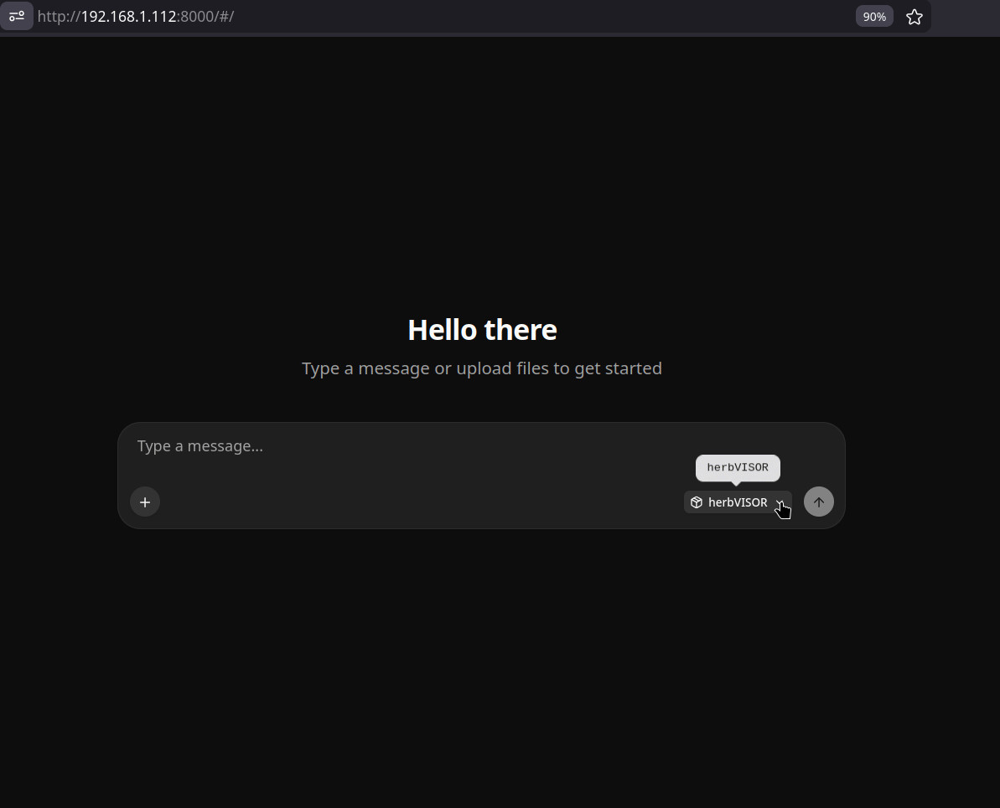

# Herb-VISOR

**Visual Inspector for Specimen Observation & Recognition**

A fine-tuned 4B vision-language model that reads herbarium specimen images and emits structured, controlled-vocabulary JSON. It reports visible specimen attributes (foliage, stem type, reproductive presence, reference markers such as labels and barcodes), not taxonomic identification. Given a specimen image and its taxon name, it returns schema-valid JSON with no prompt engineering.



**[View the dataset card](https://cappow.github.io/herb-visor/dataset-card.html)** — interactive breakdown of the training corpus: taxonomy, phenology, provenance, and the 218 contributing institutions. Every section is tagged by data source (GBIF-verified, Malon-classified, or teacher-inferred).

## What it is

Herb-VISOR (Qwen3-VL-4B) is a full-weight fine-tune trained by teacher-student distillation from a 27B teacher (qwen27b, `Qwen3.6-27B-UD-Q5_K_XL`). The compact student tracks its teacher closely while running roughly 13x faster per image, and ships as a single GGUF that runs offline on a modest GPU through llama.cpp or any GGUF-compatible backend.

Key properties:

- **Prompt-free.** No system prompt, no schema instructions. User input is the bare taxon binomial plus the image. The model was trained in two phases (phase 1 with full schema instructions, phase 2 with image + taxon only) so the schema is baked into the weights.
- **Always valid.** On the 643-specimen held-out test set, output was schema-valid, strict-parsed, controlled-vocabulary JSON 643/643 times (100%). End users do not reproduce a long prompt or preprocess instruction tokens.
- **Small and portable.** 4B parameters, llama.cpp-native GGUF (q8 ~4.3 GB, f16 ~8 GB). Runs offline. Test numbers below were produced on a single Intel Arc Pro B70 (32 GB); the q8 model also runs on a consumer 12 GB GPU using around 8 GB of VRAM.
- **Fast.** ~5.0 s/img single-stream versus ~68.6 s/img for the 27B teacher on the same hardware.

## Quickstart

Download the GGUF files (see [Model files](#model-files)), then start a server:

```bash
llama-server \
  --model herb-visor-4b-q8.gguf \
  --mmproj herb-visor-4b-mmproj-f16.gguf \
  --temp 0 \
  -c 8192 \
  --host 127.0.0.1 --port 8080
```

The only text input is the taxon binomial (standard casing, e.g. `Acer pseudoplatanus`), with the specimen image attached. Use `temperature 0` for deterministic output. The model also returns valid JSON without a taxon name; the name is included to aid reproductive-trait alignment.

The simplest path is the included client ([`infer.py`](infer.py), pure Python standard library):

```bash
python infer.py path/to/specimen.jpg "Acer pseudoplatanus"
```

Or via the OpenAI-compatible endpoint. Build the request payload in Python (a base64 image is too large to pass as a shell argument), then send it:

```bash
python3 <<'PY'
import json, base64
img = base64.b64encode(open("path/to/specimen.jpg", "rb").read()).decode()
payload = {
    "messages": [{
        "role": "user",
        "content": [
            {"type": "text", "text": "Acer pseudoplatanus"},
            {"type": "image_url", "image_url": {"url": f"data:image/jpeg;base64,{img}"}}
        ]
    }],
    "temperature": 0
}
open("/tmp/req.json", "w").write(json.dumps(payload))
PY

curl -s http://localhost:8080/v1/chat/completions \
  -H "Content-Type: application/json" \
  --data-binary @/tmp/req.json | python -m json.tool
```

Output conforms to [`schema/schema.json`](schema/schema.json).

## Results

Accuracy was measured against human-validated labels on a 100-specimen blind sample (a single non-specialist annotator scored each field cold from the image, with no access to model predictions). Per-field accuracy for Herb-VISOR on validated fields:

| Field | Accuracy | Notes |
|---|---|---|
| `structures.foliage` | 0.97 | leaf/needle presence |
| `structures.stem` | 0.79 | woody/herbaceous; hard field, 23/100 annotator-uncertain |
| `attached_photo` | 0.95 | rare positive |
| `refs.label` | 0.99 | |
| `refs.barcode` | 1.00 | |
| `refs.stamp` | 0.70 | recall 0.64; systematic misses, label/stamp boundary is ambiguous |
| `refs.crc` | 1.00 | color reference chart |
| `refs.scale_bar` | 1.00 | |
| `repro_visible` | 0.88 | reproductive structure present (category-level) |

Strict whole-specimen exact match (all 10 fields simultaneously correct) was 0.438 for Herb-VISOR and 0.484 for the teacher. This is a deliberately hard conjunction: one wrong field fails the specimen. The per-field view above reflects what a curator experiences.

Two caveats:

- Ground truth is a single non-specialist annotator over all vascular plants (n=100; 36/100 specimens carry at least one uncertain field). Some apparent model errors are likely annotator-limited (for example, bract versus leaf). Treat these numbers as a conservative floor.
- Herb-VISOR tracks its teacher closely, including the teacher's errors. Distillation preserved teacher behavior; it did not exceed it. `type` is always `PH` on herbarium input and is not a discriminative result.

### Student–teacher agreement (full test set, n=643)

The numbers above are accuracy against human labels. Separately, before human
validation, the student was scored against the teacher's captions across the
full 643-specimen test set. This measures how faithfully distillation
reproduced the teacher, **not** correctness: the teacher is itself wrong a
some of the time (see the human-validated table above, where the teacher's 
own exact-match is 0.484).

Output was valid JSON in 643/643 cases (100%) and strict-schema-parsed in
643/643 (100%). Whole-specimen exact match with the teacher was 51.6%.

Per-field agreement with the teacher:

| Boolean field | tp | fp | fn | tn | Precision | Recall | Agreement |
|---|---|---|---|---|---|---|---|
| `attached_photo` | 5 | 3 | 2 | 633 | 0.62 | 0.71 | 0.992 |
| `phenology.flower` | 232 | 63 | 52 | 296 | 0.79 | 0.82 | 0.821 |
| `phenology.fruit` | 149 | 56 | 70 | 368 | 0.73 | 0.68 | 0.804 |
| `phenology.pollen_cone` | 1 | 0 | 3 | 639 | 1.00 | 0.25 | 0.995 |
| `phenology.seed_cone` | 2 | 1 | 0 | 640 | 0.67 | 1.00 | 0.998 |
| `phenology.sporulating` | 35 | 18 | 1 | 589 | 0.66 | 0.97 | 0.970 |
| `phenology.reproductive_unknown` | 0 | 0 | 5 | 638 | — | 0.00 | 0.992 |
| `refs.label` | 643 | 0 | 0 | 0 | 1.00 | 1.00 | 1.000 |
| `refs.barcode` | 541 | 1 | 8 | 93 | 1.00 | 0.99 | 0.986 |
| `refs.stamp` | 329 | 24 | 40 | 250 | 0.93 | 0.89 | 0.900 |
| `refs.crc` | 533 | 1 | 0 | 109 | 1.00 | 1.00 | 0.998 |
| `refs.scale_bar` | 600 | 11 | 0 | 32 | 0.98 | 1.00 | 0.983 |

The fine-grained phenology fields are not human-validated; read them as
teacher-agreement only. Positive class is `true`; counts are over all 643 test
specimens.

## Reproduce the validation

The validation pipeline is pure Python standard library. No install step, no images, no network, no GPU.

```bash
cd validation
python adjudicate.py            # 100-specimen scorecards (student & teacher vs human)
python clade_consistency.py     # full-set label-free reliability check
```

Both read frozen artifacts (`preds.jsonl`, `review_verdicts.csv`, `clade_map.csv`) and write to `validation/outputs/`. The committed `clade_cache.json` makes the clade check fully offline.

### Label-free reliability check

`clade_consistency.py` checks, across all 643 predictions, whether the model
asserted a reproductive trait botanically impossible for the specimen's clade
(per the GBIF backbone). No human labels needed.

Specimen-level impossible rate: 8/643 (0.012) for Herb-VISOR, 6/643 (0.009) for
the teacher. These are an upper bound: several flagged cases are morphological
mimics, not errors. Casuarina and Allocasuarina bear woody cone-like
infructescences (flagged as seed_cone on an angiosperm), and Cycas and Gnetum
have fruit-like structures. The check catches only false positives of impossible
structures; it cannot detect a structure the model missed, nor adjudicate
on-clade positives.

## Model files

Hosted on Hugging Face: ** https://huggingface.co/CapPow/herb-visor **

| File | Purpose | Size |
|---|---|---|
| `qwen3-vl-4b-herbarium-q8.gguf` | student weights, q8 (recommended) | ~4.3 GB |
| `qwen3-vl-4b-herbarium-f16.gguf` | student weights, f16 | ~8 GB |
| `mmproj-qwen3-vl-4b-herbarium-f16.gguf` | vision projector (required) | ~0.8 GB |

The mmproj file is required for image input. Pair it with either weight file.

## Repository layout

```
validation/    Reproducible core. Pure stdlib, offline. Run from here.
schema/        Output JSON schema and the clade-relaxation reference list.
provenance/    Inspect-only: teacher captioning, blind sampler, review GUI,
               schema migration, clade enrichment, training notebook.
               Documented for transparency, not packaged for re-execution.
docs/          Notes, lineage, image re-harvest instructions, caveats.
```

See [`docs/NOTES.md`](docs/NOTES.md) for project lineage, the image-licensing and re-harvest path, and the full interpretation caveats.

## Limitations

- `repro_visible` is category-level (a reproductive structure is present). Fine-grained phenology (flower vs fruit vs cone type) was not human-validated.
- Output is a curator-assist candidate, not authoritative write-back. Validation is single-annotator, n=100; ground truth is soft.
- Images are not distributed (mixed licenses). They are re-harvestable from GBIF by `gbifID` (the image filename stem and universal join key). See `docs/NOTES.md`.

## License

Repository code is released under the MIT license. The model weights are a full-weight fine-tune of [Qwen/Qwen3-VL-4B-Instruct](https://huggingface.co/Qwen/Qwen3-VL-4B-Instruct) (Apache 2.0) and are released under Apache 2.0, with a derivation notice on the [model repository](https://huggingface.co/CapPow/herb-visor). Training images are GBIF-derived and follow their source-institution terms; they are not redistributed here (see [`docs/NOTES.md`](docs/NOTES.md)).

## Citation

```bibtex
@software{powell2026herbvisor,
  author  = {Powell, Caleb and Sterner, Beckett},
  title   = {Herb-VISOR: a compact vision-language model for
             structured captioning of herbarium specimens},
  year    = {2026},
  url     = {https://github.com/CapPow/herb-visor},
  note    = {Software and model weights; manuscript in preparation}
}
```
